# README

## 0x01 写工具的背景和意义

在攻防场景下，防守方经常会遇到一些加密webshell，如godzilla、冰蝎 以及基于其魔改的webshell，防守方在溯源分析的时候，借助解密工具可以批量的解密流量来看攻击者使用webshell进行了哪些操作，横向进展等（在有流量监测设备的场景下，如IDS、全流量设备或者NIS等）。这个工具就是用来解密一些webshell流量的，支持单流量和批量；本来是想做一个全方面diy的解密工具，但是由于一些原因，这个工具目前只能在一定范围内div，使用者可以根据自己对webshell的分析，自定义解密，调用工具固化的一些模块即可。

工具内置的模块有：

- del 16  (去哥斯拉对响应流量的混淆)

- Dbase64
-  D  AES/EBC  AES/CBC      填充方式 nopadding / PKCSpaddding
- DURL
- DGZIP
- Unserialize (去godzilla类马使用的格式化)

## 0x02 环境

本地需要jdk环境，最好使用jdk11（其他版本中低版本可能部分功能不兼容）

## 0x03 使用

运行命令：

``java -jar Webshel_Traffic_Decoder.jar``

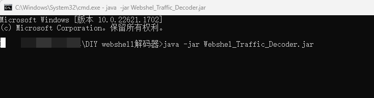

工具界面如下：

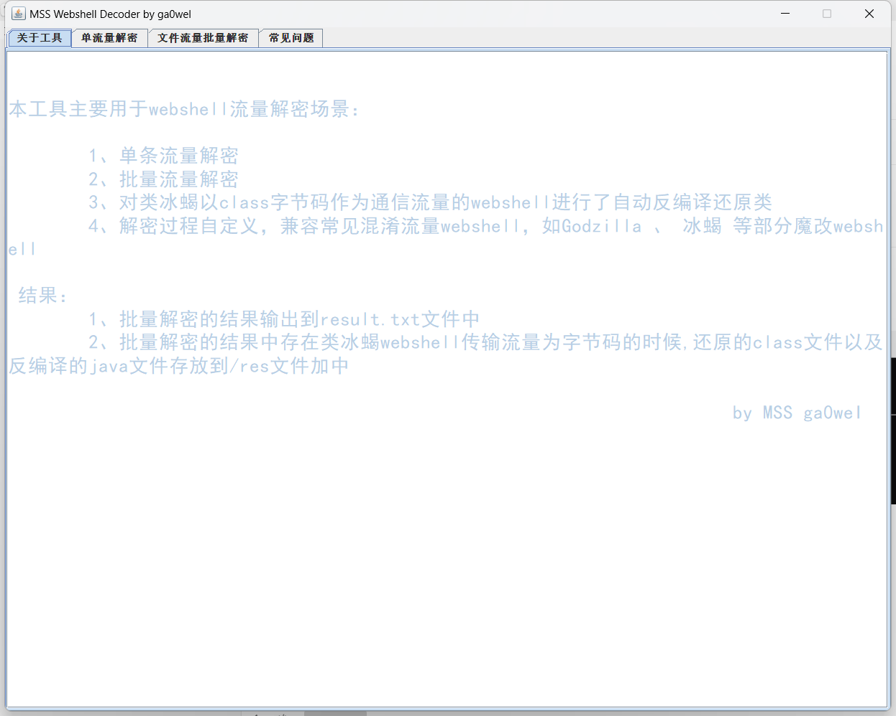

## 0x04 四个模块

### 模块1、4：

如下两个界面：

第一个模块是工具的一个简单介绍，工具的功能

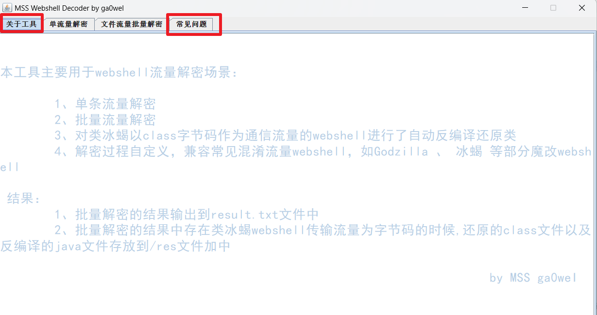

第四个模块是常见通用webshell流量如何使用本工具解密（其实就是常见webshell流量是怎么加密的，反着推就行）

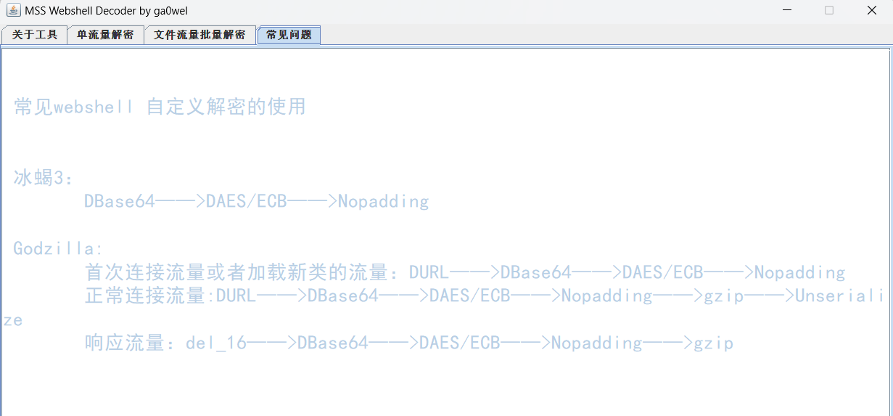

### 模块2：

此模块如下为单流量解密：

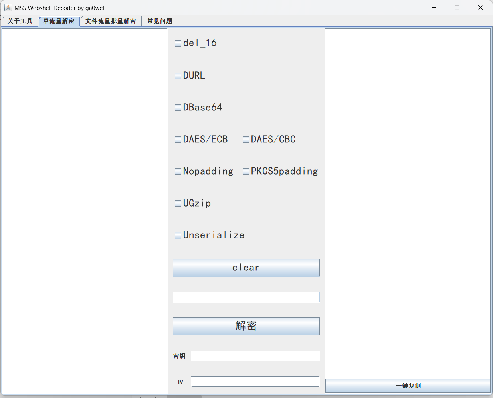

下面我们使用两个通用webshell来测试下解密，使用方法没啥好说的，需要什么把什么勾上，以及填写密钥即可

冰蝎3：

如下是一个正常丢到冰蝎3webshell：

密钥为：``e45e329feb5d925b``

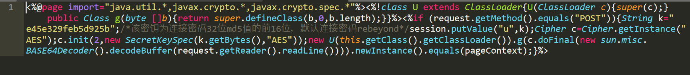

其流量如下：请求流量，webshell连接的请求体

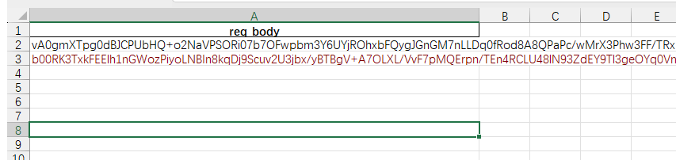

使用工具单流量解密模式解密：

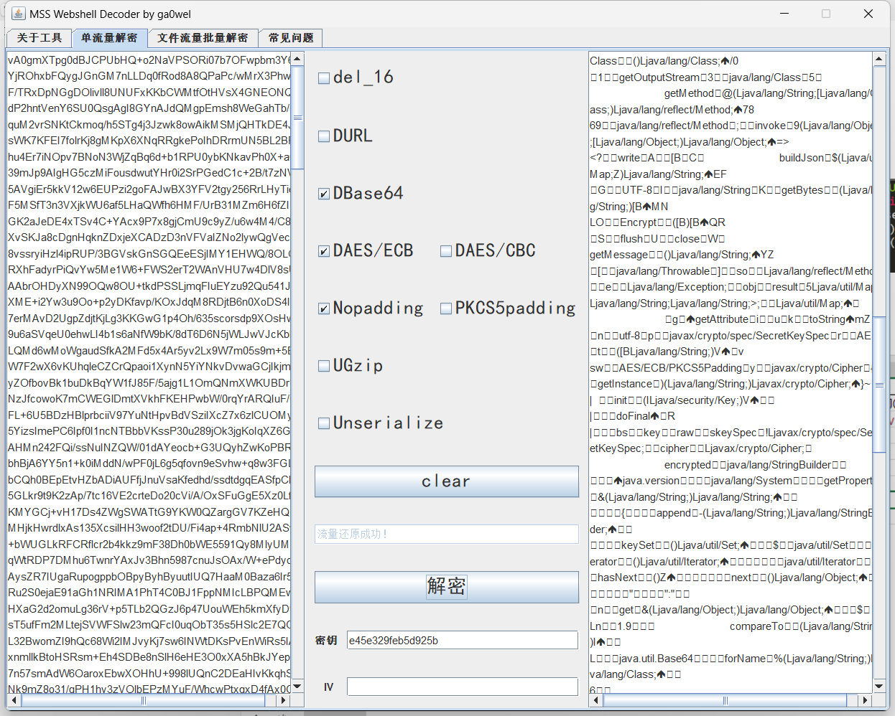

哥斯拉：

如下是一个标准的godzilla webshell: 密钥``e10adc3949ba59ab``

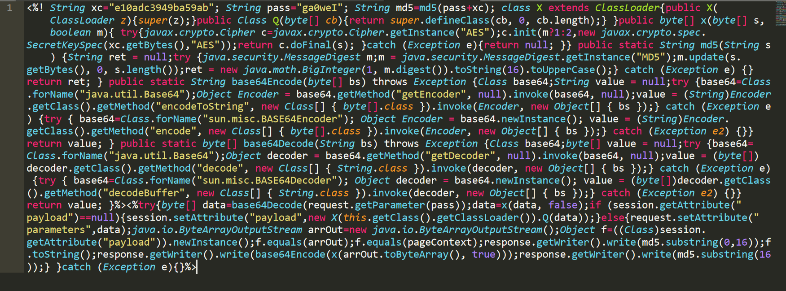

其请求响应流量如下：

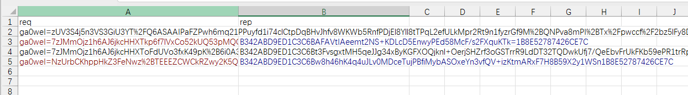

解密请求流量： 注意这里我们单流量解密的时候，请求体流量里面的密码要去掉（干掉ga0weI=）,如下图

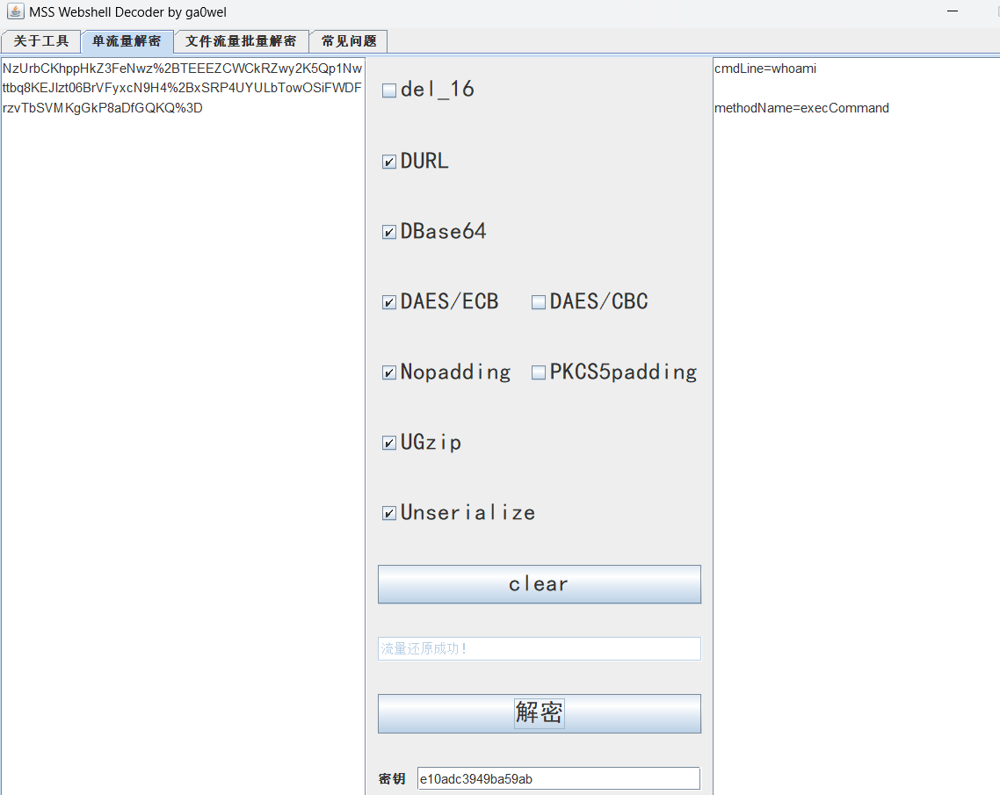

解密响应流量：

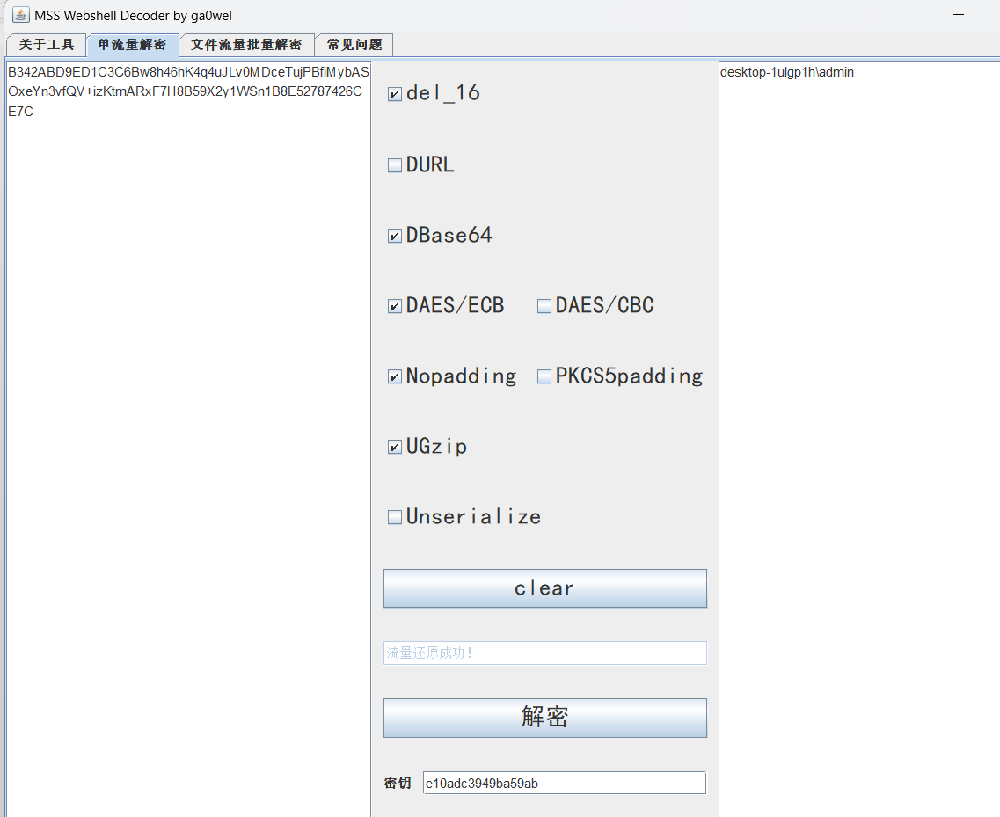

### 模块3：

批量解密模块：对指定的xlsx文件中指定列的指定字段进行内容提取（基本就是webshell连接流量的请求体和响应体），进行批量的流量解密，当出现一些类冰蝎payload的时候，会对字节码payload类，进行反编译还原成java文件。

如下图是该模块界面：

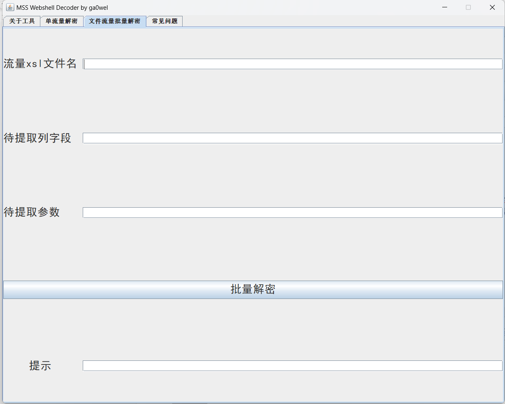

这里拿上面的哥斯拉流量测试：

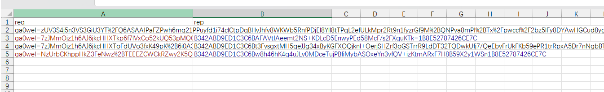

我们先尝试批量解密请求流量：

使用工具批量解密的前提是单个解密能搞定:

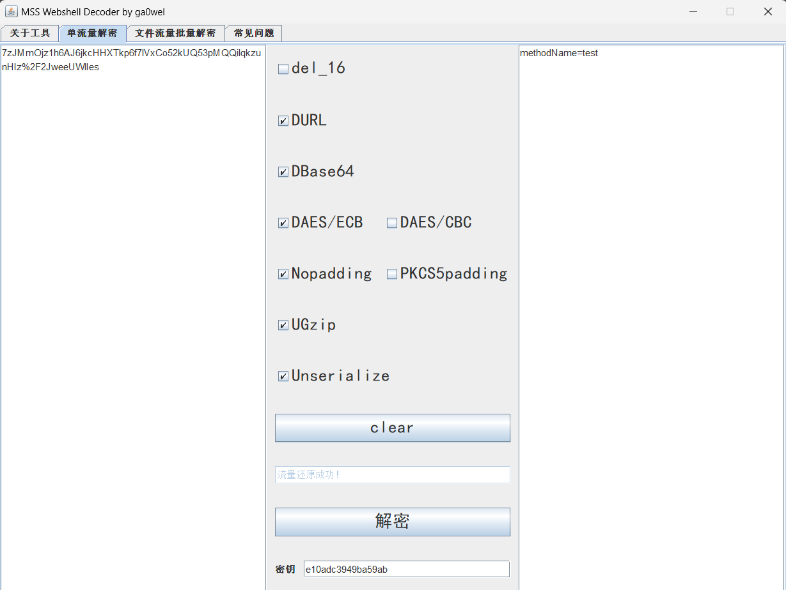

然后我们来到批量解密的模块：填入需要的参数：

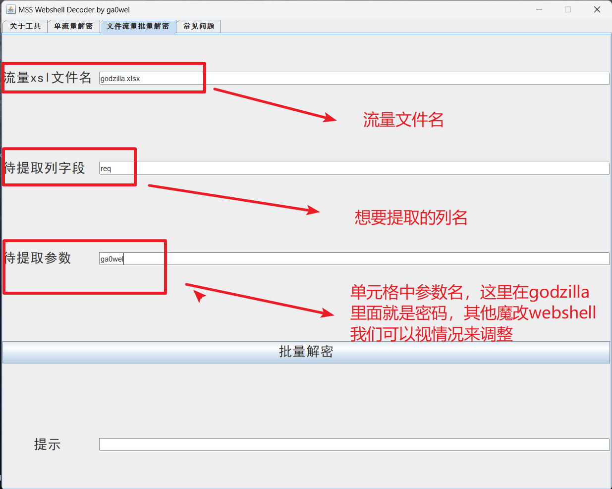

点解批量解密：

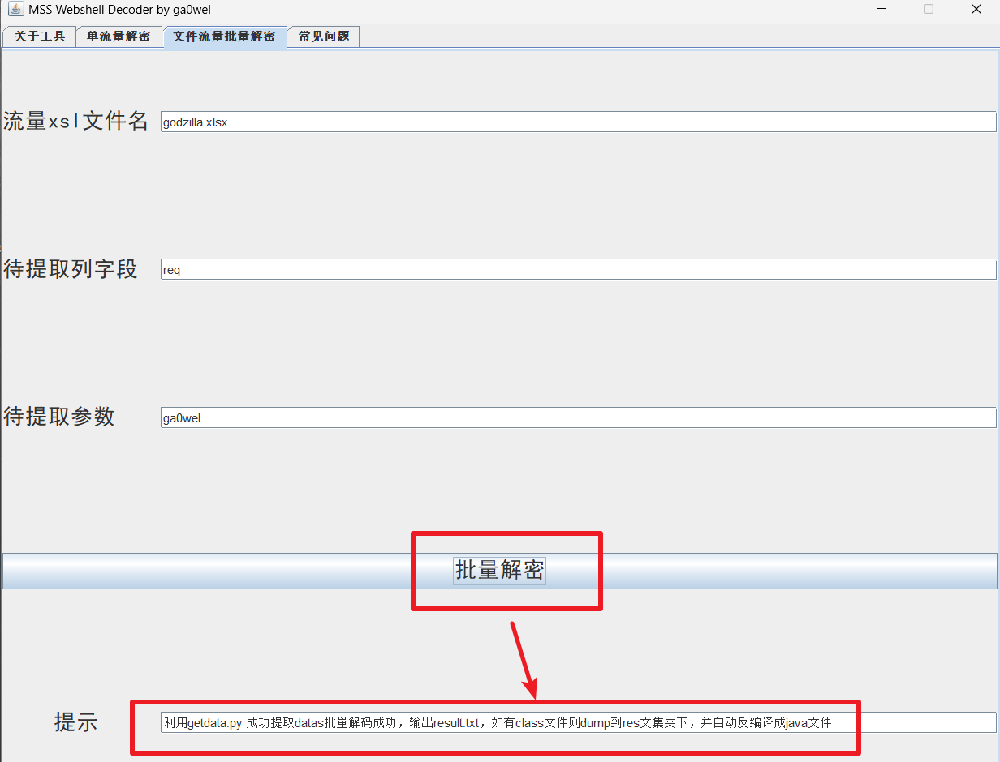

查看解密结果：

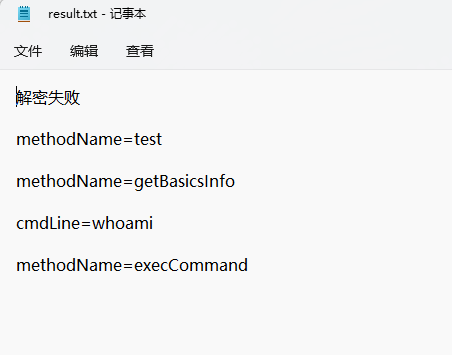

第一条解密失败，因为godzilla的首次连接流量的解密方式和正常之后不太一样：如下是首次解密需要的配置：

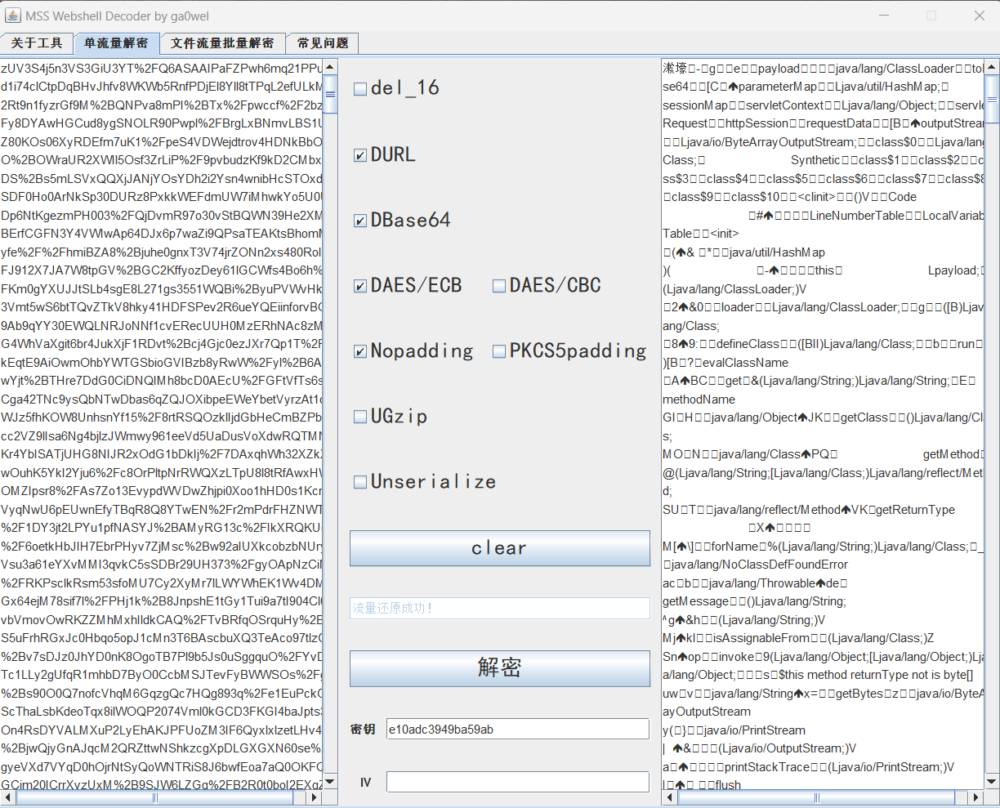
